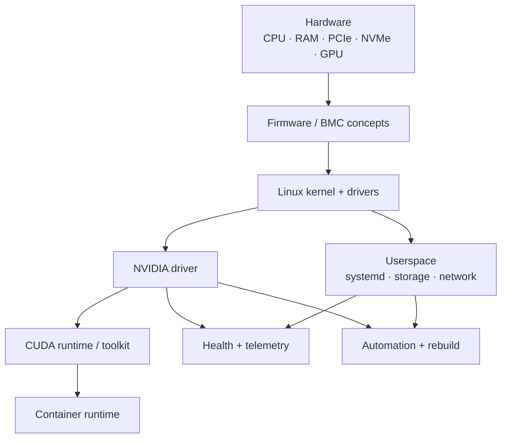

# Phoenix-Node

> **Project Phoenix — resurrect a failed AI compute node, learn everything that makes it live, then prove you can rebuild it from ashes.**

## Project status

| Field | Current state |
|---|---|
| **Status** | **Active — foundation project** |
| **Current stage** | Ready to begin Mission 00 / initial PHX-07 inventory; no mission completion is claimed yet |
| **Lab environment** | Ubuntu Server VM for core work; local NVIDIA GPU access where practical |
| **Evidence rule** | Real lab output is labeled measured; enterprise-only hardware/topology is labeled modeled/reference |
| **Last plan sync** | 2026-08-19 |
| **License** | No open-source license is granted unless an explicit license is added later |

## Skills you will build

- Production-style Linux administration
- Boot process, services, users, permissions, storage, and networking
- `systemd`, logs, process management, and host troubleshooting
- NVIDIA driver, CUDA, and GPU runtime fundamentals
- GPU validation and basic health checks
- Bash first, then Python/Ansible automation
- Configuration management and repeatable provisioning
- Failure injection, incident diagnosis, and recovery
- Hardening, documentation, and change discipline

## General idea

Phoenix-Node is the **single-host foundation lab** for the portfolio.

You inherit a fictional compute node called **PHX-07**. It was pulled from an AI cluster after a series of unexplained failures, its documentation is incomplete, and nobody trusts it enough to put it back into service.

Your job is to bring it back.

At first, that means understanding an ordinary Linux machine from the bottom up. Later, it means installing and validating the NVIDIA software stack, deliberately breaking the host in realistic ways, diagnosing those failures from evidence, and finally automating enough of the build that PHX-07 can be erased and recreated predictably.

The final question is simple:

> **If this node died tonight, could I explain why, recover it, and rebuild it without relying on memory?**

This lab can be completed on a laptop using an Ubuntu VM for most exercises. GPU-specific stages can use a Linux installation with access to the laptop's NVIDIA GPU where practical; anything that cannot be reproduced locally should be documented as modeled rather than faked.

---

# The story: PHX-07

Helios Compute once operated a small accelerated-computing cluster. One node developed a reputation.

PHX-07 would disappear from monitoring. Services would fail after reboot. Engineers disagreed about which CUDA version it needed. A storage mount occasionally vanished. Someone fixed SSH by changing three settings and never documented which three.

Eventually the node was shut down and labeled:

> **DO NOT RETURN TO PRODUCTION**

You have been given the machine and one instruction:

> Make it boring.

A good infrastructure node should not be mysterious. Its configuration should be explainable, its failures should be diagnosable, and its rebuild should be repeatable.

Phoenix-Node turns that requirement into a campaign.

---

## Campaign map

| Chapter | Incident / objective | Core skills | Victory condition |
|---|---|---|---|
| 00 | **The Ashes** | hardware/OS inventory, architecture, documentation | explain what exists before changing it |
| 01 | **First Heartbeat** | Linux install, boot chain, users, SSH, time, packages | stable, remotely manageable Linux host |
| 02 | **The Machine Beneath Linux** | CPU, RAM, PCIe, storage, kernel, devices | trace hardware into the OS |
| 03 | **Services in the Dark** | `systemd`, processes, logs, dependencies | diagnose a failed service without guessing |
| 04 | **The Vanishing Volume** | partitions, filesystems, mounts, permissions | repair storage failures and explain persistence |
| 05 | **The Lost Node** | interfaces, routes, DNS, sockets, firewall basics | distinguish host, network, and application faults |
| 06 | **Ignition** | NVIDIA driver, CUDA layers, `nvidia-smi` | GPU is visible and software layers are explained |
| 07 | **Trial by Fire** | load, thermals, logs, GPU health | establish a healthy baseline under stress |
| 08 | **Sabotage Week** | deliberate multi-layer failures | diagnose injected faults from evidence |
| 09 | **The Ritual Becomes Code** | Bash, Python, Ansible, idempotency | automate repeatable configuration |
| 10 | **Burn It Down** | rebuild, validation, documentation | recreate the node from a clean starting point |
| FINAL | **Rise Again** | full-stack recovery | recover an unknown broken PHX-07 and produce an incident report |

---

## The Phoenix rule

Every change should answer four questions:

```text
1. What problem am I solving?
2. What layer am I changing?
3. How will I prove it worked?
4. How would I undo or recreate it?
```

A command that works but cannot be explained does not count as mastery.

---

## What PHX-07 eventually looks like



The purpose of the diagram is not decoration. As the lab grows, you should be able to point at a symptom and identify which layers could plausibly cause it.

---

## Failure deck

Once the healthy baseline exists, PHX-07 gets sabotaged.

Potential incidents include:

- a service disabled or misconfigured
- a filesystem or mount failure
- broken ownership or permissions
- a bad environment variable or PATH assumption
- DNS failure with otherwise healthy IP connectivity
- a closed application port
- exhausted disk space
- a runaway process
- a package/version mismatch
- NVIDIA driver/module problems
- GPU workload failure with a healthy host
- reboot-dependent configuration that was never persisted

The goal is **not** to see how quickly you can type the repair.

The goal is to establish:

```text
symptom
  ↓
expected state
  ↓
evidence
  ↓
failed layer
  ↓
hypothesis
  ↓
test
  ↓
root cause
  ↓
repair
  ↓
prevention / automation
```

---

## Evidence to keep

The finished project should contain evidence created during real work, such as:

- architecture diagrams
- selected command output
- configuration files
- before/after validation
- scripts and Ansible roles
- failure scenarios
- incident reports
- recovery measurements
- lessons learned and tradeoffs

Do **not** add fictional benchmark results or pretend a simulated component was physical hardware.

---

## Repository structure

```text
Phoenix-Node/
├── README.md
├── missions/
├── automation/
├── configs/
├── incidents/
├── evidence/
├── diagrams/
└── SECURITY.md
```

Additional directories should be added when real work needs them. The existing support directories are intentionally instructions-only until evidence is actually produced.

---

## Completion standard

Phoenix-Node is complete when you can take a clean Linux starting point and produce a documented GPU-ready host whose:

- important configuration is explainable,
- health can be validated,
- common failures can be diagnosed systematically,
- important setup is automated,
- and rebuild procedure has actually been tested.

The capstone is not **"I installed CUDA."**

It is:

> **"I understand this node well enough to kill it, diagnose it, and bring it back."**
